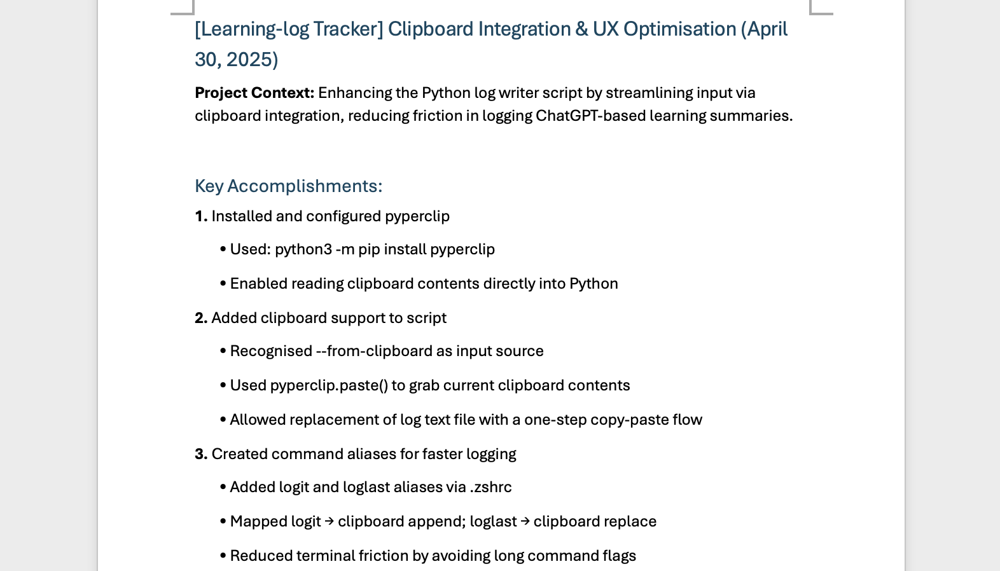

# 📘 Learning Log Writer (Python)

A lightweight Python script to track and write learning summaries directly into a Word document — perfect for developers who want to build a reflective, structured learning habit as they code and debug.

Built as a personal tool to support my own learning process while working on side projects, this script helps capture bite-sized insights and technical wins into a single `.docx` learning log.

## ✨ Features

- Append new learning logs from a `.txt` file or your clipboard
- Replace your latest log entry using `--replace-last`
- Automatically formats the log with:
  - Proper section headings (e.g. "Key Accomplishments", "Reflection")
  - Bullet points and indentation
  - Clean date formatting (e.g. `(Apr 30, 2025)`)
- Designed for daily/weekly usage with terminal aliases (`logit`, `loglast`)
- Keeps personal logs out of the repo via `.gitignore`

---

## 🚀 Setup

### 1. Install dependencies

```bash
python3 -m pip install python-docx pyperclip
```

### 2. Create your own .docx file

Name it:

Programming Learning Log.docx
⚠️ Make sure it's placed in the same folder as the script — or update the filename in append_log_to_docx.py.

### 3. (Optional but recommended) Add terminal aliases

Edit your `~/.zshrc` or `~/.bashrc` and add:

```bash
alias logit='python3 append_log_to_docx.py --from-clipboard'
alias loglast='python3 append_log_to_docx.py --from-clipboard --replace-last'
```

Then run:

```bash
source ~/.zshrc  # or source ~/.bashrc
```

## 💡 Usage

Add a new log:
```bash
logit
```

Replace your last log:
```bash
loglast
```

Or using a .txt file instead of clipboard:
```bash
python3 append_log_to_docx.py sample_log.txt
python3 append_log_to_docx.py sample_log.txt --replace-last
```

## 🛑 Privacy Note

This repo does not track your actual learning log (`Programming Learning Log.docx`).

That file is intentionally ignored via `.gitignore` so you can clone the script without privacy concerns.

## 📸 Sample Output



## 🧠 Why I Built This

I wanted a frictionless way to reflect on my coding progress and build a habit of documenting what I'm learning — especially after fixing bugs, solving DevOps issues, or experimenting with new programming languages while building interesting stuff.

This script fits naturally into my CLI workflow, and gives me a structured log I can review anytime to see how far I've come.

